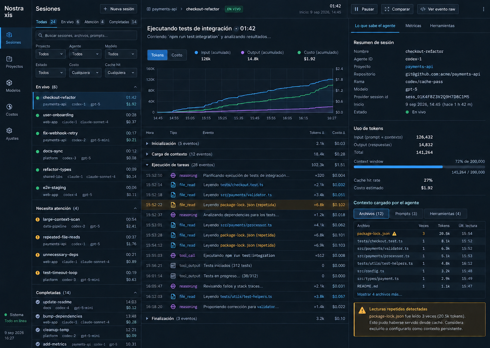

<div align="center">

# Nostraxis

**One local panel to observe, launch and compare work done with coding agents.**

ChatGPT/Codex · Claude Code · GitHub Copilot CLI · Hermes Agent — without sending your history to any external service.

[](LICENSE)
[](https://nodejs.org)
[](https://react.dev)
[](https://vite.dev)
[](https://nodejs.org/api/sqlite.html)
[](#privacy-and-data-boundaries)
[](CONTRIBUTING.md)

[](https://github.com/DaniBelmonte/Nostraxis/stargazers)
[](https://github.com/DaniBelmonte/Nostraxis/issues)
[](https://github.com/DaniBelmonte/Nostraxis/commits)

### 🌐 Language

[Español](README.es.md) · **[English](README.md)** · [Français](README.fr.md) · [Português](README.pt.md) · [Italiano](README.it.md)

</div>

---

Nostraxis is a local dashboard to observe, launch and compare work done with general-purpose agents. It brings **ChatGPT/Codex**, **Claude Code**, **GitHub Copilot CLI** and observed **Hermes Agent** sessions into a single view, without sending your history to a Nostraxis service and without replacing each provider's own authentication.



It is designed for two ways of working:

- Reviewing, from a single place, the sessions you already opened with your usual tools.
- Using it as your local work surface: pick a repository, create a session with **New session** and run the chosen agent from that repository.

## ✨ What you get

| | |
| --- | --- |
| 🔌 **Multi-provider** | Codex, Claude Code, Copilot CLI and Hermes Agent in one view, with their connection status. |
| 🧭 **Own and external sessions** | Launch sessions from the dashboard or discover the ones already in your local histories. |
| ⚖️ **Compare** | Contrast up to four real sessions: model, tokens, cost, duration, tools and files. |
| 📊 **Analytics** | Aggregates by repository, provider, model and date range. |
| 🔒 **Local-first** | SQLite on your disk, no telemetry of its own and no custody of provider credentials. |
| 🧪 **R&D Lab** | Reproducible variant matrix with a SHA-256 digest (optional). |

## 📚 Contents

- [Quick install](#quick-install)
- [Connecting ChatGPT/Codex, Claude, Copilot and Hermes](#connecting-chatgptcodex-claude-copilot-and-hermes)
- [Working with repositories and New session](#working-with-repositories-and-new-session)
- [What Sessions means](#what-sessions-means)
- [Comparing prompts, agents and sessions](#comparing-prompts-agents-and-sessions)
- [Usage, credits and costs](#usage-credits-and-costs)
- [Privacy and data boundaries](#privacy-and-data-boundaries)
- [Advanced configuration](#advanced-configuration)
- [Troubleshooting](#troubleshooting)
- [Local API](#local-api)
- [Contributing](#contributing)
- [Security](#security)
- [License](#license)

## Quick install

### Requirements

- Node.js **22.5 or later**. Local storage uses `node:sqlite`.
- One or more agent CLIs installed and authenticated if you want to launch sessions or discover histories: Codex, Claude Code, GitHub Copilot CLI or Hermes Agent.
- Git is recommended so each repository's branch and commit can be recorded; a readable local folder can also be registered.

### Starting the dashboard

From the repository root:

```bash
npm install
npm run dev
```

Open [http://localhost:4173](http://localhost:4173). The development server restarts its local API when backend files change, so newly added routes become available without a manual restart. On macOS you can also open `start-dashboard.command`; it starts in its own Terminal window and stays available as long as that window is open.

Useful commands:

```bash
npm test
npm run build
npm start
npm run check
```

The dashboard starts with no demo data. For isolated visual development you can use:

```bash
NOSTRAXIS_SEED=1 npm run dev
```

## Connecting ChatGPT/Codex, Claude, Copilot and Hermes

There are no passwords or subscription keys to configure inside the interface. Install and sign in to each provider's CLI through its own official flow, and open the dashboard as the same macOS/Linux/Windows user. On start, Nostraxis detects the available executables and the local histories.

| Provider | To launch a session from the dashboard | External history that is discovered | What to check if it does not appear |
| --- | --- | --- | --- |
| ChatGPT / Codex | Codex CLI authenticated with your ChatGPT/Codex account | `~/.codex/sessions` | That `codex` is on `PATH` and that you created at least one local session. |
| Claude | Claude Code authenticated | `~/.claude/projects` | That `claude auth status --json` reports a valid session and that `claude` is on `PATH`. |
| GitHub Copilot | GitHub Copilot CLI authenticated | Copilot CLI/Agent sessions in `${COPILOT_HOME:-$HOME/.copilot}/session-state`, plus local VS Code Stable and Insiders Copilot Chat sessions in `workspaceStorage` | Check the matching source separately in **Settings**; for the account quota, sign in with `gh auth login` as well. |
| Hermes Agent | Not available in this POC | Read-only sessions in `~/.hermes/state.db`, including CLI, cron and messaging channels | That `hermes --version` works and that the SQLite state file is readable. |

Open **Settings → Session sources** to check detected histories or add a custom provider-history folder or file. Adding a source saves it locally and syncs it immediately; the watcher then refreshes it automatically. In **Sessions**, the sync button forces a re-read. A work-project workspace is the code folder used for grouping, while an agent's history may be stored elsewhere; configure the latter in Settings before expecting its sessions to appear in the project.

Copilot being connected only confirms that its executable or account is available; it does not mean every local conversation uses the same store. Nostraxis labels **GitHub Copilot CLI / Agent** and **VS Code Copilot Chat** separately. The VS Code adapter rebuilds the editor's local `chatSessions` journals, imports only visible user/assistant messages and reported tokens or AI credits, and associates them with the folder in the adjacent `workspace.json`. Histories from another computer are not downloaded from GitHub. Remote SSH, Dev Container, custom `--user-data-dir`, VSCodium or other installations can store data elsewhere; add their local `workspaceStorage` folder in Settings or configure `NOSTRAXIS_VSCODE_CHAT_ROOTS_JSON`.

If the executable is not on `PATH`, point to it for the dashboard process only:

```bash
export NOSTRAXIS_CODEX_BIN='/absolute/path/to/codex'
export NOSTRAXIS_CLAUDE_BIN='/absolute/path/to/claude'
export NOSTRAXIS_COPILOT_BIN='/absolute/path/to/copilot'
export NOSTRAXIS_HERMES_BIN='/absolute/path/to/hermes'
npm run dev
```

Hermes is intentionally observation-only in the initial integration. Its native source is preserved (`desktop`, `cli`, `cron` or a messaging channel) and classified as **Interactive**, **Automation** or **Messaging**. This is a Hermes-specific distinction: its filter and grouping control appear only after selecting Hermes as the provider. By default every native source is imported; `NOSTRAXIS_HERMES_SOURCES` can restrict that set explicitly.

### Copilot: account quota

The Copilot card can read the plan, monthly limit, usage, balance and reset date that GitHub exposes to the active GitHub CLI account. It does not reuse or store the `gh` credential. If that session does not exist on the machine, you can provide a short-lived token to the dashboard process only:

```bash
export NOSTRAXIS_COPILOT_TOKEN='github-token-with-copilot-access'
npm run dev
```

The token is not persisted. In Business or Enterprise organizations, the value shown is the personal budget when GitHub exposes it; organization-wide billing reports still require their own permissions.

## Working with repositories and New session

You can use Nostraxis as your local work surface for any of the three agents. The dashboard runs the selected CLI inside the repository folder: it does not clone the code or move the project elsewhere.

1. Go to **Repos**.
2. Paste the absolute path of your local folder, for example `/Users/ana/code/my-api`, and press **Register repository**. If it is a Git repository, the current branch and `HEAD` are stored as well.
3. Go back to **Sessions** and press **+ New session**.
4. Choose the registered repository, the provider and, where applicable, the model.
5. Give it a name, write the goal and decide whether to allow commands and file changes.
6. Press **Create session**. The session runs from that folder and is traced in the dashboard.

This lets you work with Codex, Claude or Copilot while keeping a single panel for context, output, commands, touched files and whatever metrics the provider reported. The write-permission option only affects sessions created from Nostraxis; review it before starting a task that will modify your checkout.

## What Sessions means

**Sessions** is the dashboard's operational history. Each row represents a detected run or conversation, labelled by project, provider, model, status and origin.

| Session type | Origin | What you can do |
| --- | --- | --- |
| **Dashboard** | Created with **New session** | See the stream, conversation, commands, files, context, metrics, and cancel a run that is still in progress. |
| **External** | Discovered in the local histories of Codex, Claude, Copilot or Hermes | Inspect and filter the observed data. It stays read-only: you must continue or cancel that conversation from its original tool. |

Use the tabs to switch between active, recent and all sessions; filters narrow by project, provider, model, status, origin, update time, cost and cache. Grouping by project or status makes it easier to follow several open tasks at once. Selecting Hermes also enables its provider-specific type filter and grouping.

When you select a session, the central panel shows its timeline and, when the source exposes it, tokens, cost, credits, duration and events. Duration is the **active time**: the intervals where the agent was reporting work, measured from the real event timestamps. The time before each user action and any long silence are excluded, so a conversation resumed the next day is not read as a day of execution. The **conversation span** and the **last turn** appear beside it, so the latest interaction can still be measured on its own. The side inspector keeps the repository, branch, commit, prompt, tools and related files. A **Not reported** value means the provider did not deliver it: it never equals zero and is never silently estimated.

## Comparing prompts, agents and sessions

The **Compare** view contrasts up to four real sessions. It is useful both for reviewing different prompts and for running the same prompt several times to evaluate different agents, models or permissions.

### Recommended flow for a controlled test

1. Register the same repository and fix a stable branch or commit.
2. Create one session per variant in **New session**. To compare agents, use the same goal on Codex, Claude and/or Copilot. To compare prompts, change only the text you want to evaluate.
3. Avoid changes to the starting files between runs, or record the difference explicitly.
4. Go to **Compare**, search sessions by project, model or date, and select them.
5. Read the results together with the `Context digest`, the output and the files/tools used; a difference in context or task can invalidate a cost or speed comparison.

The matrix shows model, input/output tokens, estimated cost, provider credits, duration, cache, reasoning, evaluation, tools, files, context digest and final answer when present. From each column you can open the session detail. Fields the provider did not supply stay as **Not reported**.

For usage reports, **Analytics** aggregates sessions by repository, provider, model and date range. It includes a per-model breakdown, cost/token ratio, a time series and access to the detail of each run. This is the right view to answer, for example, which agent consumed most in a repository or how cost evolved over a week.

### Reproducible experiments (optional)

The **R&D Lab** creates a variant matrix with a shared task and keeps the rendered prompt, the context, the repository `HEAD` and a SHA-256 digest to make repetition easier. Enable it when starting the dashboard:

```bash
NOSTRAXIS_EXPERIMENTS_ENABLED=1 npm run dev
```

The available strategies are `raw-repo`, `knowledge-base` and `llm-wiki`. Unset the variable or use a value other than `1` to hide this feature again.

## Usage, credits and costs

At the top right there are cards for **Codex / ChatGPT**, **Claude**, **GitHub Copilot** and **Hermes Agent**. Click a card to open the source detail, the known model, the connection status and the last update. That way you can check from a single place what each provider allows you to observe.

| Provider | Centralized data when available | Correct scope |
| --- | --- | --- |
| Codex / ChatGPT | Usage-limit windows, credits/balance and tokens of the most recent Codex session. | The limits shown are the ones Codex records locally; they are not a consolidated ChatGPT bill. |
| Claude | Authentication status, data from the observed session and tokens/credits Claude reports. | Claude may not expose a total subscription quota in local data; in that case it is shown as unavailable. |
| Copilot | Plan, monthly credits or premium requests, used, available, reset date and usage observed per date range. | The account quota and the sum of local chats are different sources and are not mixed. |
| Hermes | Tokens and cost reported by the selected local session. | The current POC reads local session data, not an account-wide quota; absent usage remains unavailable. |

The dashboard distinguishes three concepts that should not be confused:

- **Subscription limit or quota:** counter and reset date provided by the provider.
- **Provider credits:** provider-specific units, such as AI credits or Copilot premium requests. They are not dollars and are not comparable across providers.
- **Estimated cost:** a USD amount computed only when you configure per-model prices and there are enough tokens. It does not replace the provider's bill.

To enable estimated cost, define USD prices per million tokens before starting the server:

```bash
export NOSTRAXIS_PRICING_JSON='{"model-id":{"inputPerMillion":1.25,"cachedInputPerMillion":0.25,"outputPerMillion":10}}'
npm run dev
```

## Privacy and data boundaries

Nostraxis is local-first. Its SQLite database lives by default at `.nostraxis/dashboard.sqlite` inside the dashboard project. You can change that location with `NOSTRAXIS_DATA_DIR`.

The watcher imports visible prompts and answers, tool metadata and usage the source reported. It does not import system prompts or hidden reasoning. External sessions are observation only; it does not take control of them.

For Hermes, Nostraxis opens `state.db` in read-only and query-only mode. It never mutates Hermes state, and it does not launch or manage Hermes sessions in this POC.

For VS Code Copilot Chat, Nostraxis reads the editor's local journal but excludes hidden transcript entries, agent instructions, tool payloads and reasoning blocks. The journal format is internal to VS Code, so unknown future records are ignored rather than inferred.

Copilot launched from Nostraxis enables the official OpenTelemetry exporter to an isolated JSONL at `.nostraxis/copilot-otel`, with message-content capture disabled. If you want to enrich external Copilot sessions with telemetry you already have, point to the file or directory:

```bash
export NOSTRAXIS_COPILOT_OTEL_PATH='/absolute/path/copilot-otel.jsonl'
```

For mounted or shared histories, replace the source list and adjust the discovery limits:

```bash
export NOSTRAXIS_SESSION_ROOTS_JSON='[{"provider":"codex","root":"/absolute/path/codex-sessions"}]'
export NOSTRAXIS_SESSION_MAX_FILES=200
export NOSTRAXIS_SESSION_MAX_AGE_DAYS=30
```

## Advanced configuration

| Variable | Purpose |
| --- | --- |
| `NOSTRAXIS_DATA_DIR` | Directory that will hold the SQLite database and the dashboard's own data. |
| `NOSTRAXIS_CODEX_BIN` | Path to the Codex executable when it is not on `PATH`. |
| `NOSTRAXIS_CLAUDE_BIN` | Path to the Claude executable when it is not on `PATH`. |
| `NOSTRAXIS_COPILOT_BIN` | Path to the Copilot executable when it is not on `PATH`. |
| `NOSTRAXIS_HERMES_BIN` | Path to the Hermes executable when it is not on `PATH` or under `~/.local/bin`. |
| `NOSTRAXIS_HERMES_STATE_DB` | Alternate path to the Hermes SQLite state database. |
| `NOSTRAXIS_HERMES_SOURCES` | Optional comma-separated allowlist of native Hermes sources. When unset, every source is imported. |
| `NOSTRAXIS_HERMES_MAX_AGE_DAYS` | Hermes discovery window in days; defaults to `90`. |
| `NOSTRAXIS_HERMES_MAX_SESSIONS` | Maximum number of Hermes sessions imported; defaults to `200`. |
| `COPILOT_HOME` | Copilot configuration and state directory. Nostraxis reads its `session-state` child when set. |
| `NOSTRAXIS_COPILOT_TOKEN` | Short-lived token to query the personal Copilot quota if `gh auth login` is not used. Not stored. |
| `NOSTRAXIS_VSCODE_CHAT_ROOTS_JSON` | JSON array of additional or custom VS Code `workspaceStorage` roots; replaces the platform defaults for this source. |
| `NOSTRAXIS_PRICING_JSON` | Per-model price table to estimate USD. |
| `NOSTRAXIS_EXPERIMENTS_ENABLED=1` | Enables the R&D Lab and its experiments API. |
| `NOSTRAXIS_SESSION_ROOTS_JSON` | Replaces the history locations that are watched. |
| `NOSTRAXIS_SESSION_MAX_FILES` | Maximum number of history files inspected. |
| `NOSTRAXIS_SESSION_MAX_AGE_DAYS` | Maximum age of the discovered histories. |
| `NOSTRAXIS_COPILOT_OTEL_PATH` | Path to existing Copilot OpenTelemetry data. |

## Troubleshooting

| Problem | Check and fix |
| --- | --- |
| I do not see sessions from a provider | Open **Settings**, confirm the history path shows as detected, create a session with that CLI and press sync in **Sessions**. |
| I do not see a VS Code Copilot chat | Check that **VS Code Copilot Chat** is detected in **Settings**. Stable and Insiders are automatic; remote, custom user-data and other editor installations require `NOSTRAXIS_VSCODE_CHAT_ROOTS_JSON`. |
| The provider shows as unavailable | Check that its executable responds in the same Terminal you started the dashboard from. If it lives elsewhere, set the matching `*_BIN` variable. |
| I cannot create a session | Register a repository in **Repos** first and select one in **New session**. The goal cannot be empty. |
| No costs appear | Configure `NOSTRAXIS_PRICING_JSON`; without prices or reported tokens, cost stays unavailable. |
| I do not see the Copilot quota | Run `gh auth login` with an account that has Copilot, or provide the temporary token to the process. Visibility depends on what GitHub exposes for your plan. |
| Fields missing in Compare or Analytics | The dashboard does not fill in absent metrics. Check the session detail and compare only dimensions both sources reported. |

## Local API

| Method | Path | Purpose |
| --- | --- | --- |
| `GET` | `/api/dashboard` | Initial data: repositories, sessions, analytics, experiments and provider status. |
| `GET` | `/api/runs/:id` | Timeline, context and detail of a run. |
| `POST` | `/api/runs` | Creates a local session with a provider. |
| `POST` | `/api/runs/:id/cancel` | Cancels a dashboard run that is still active. |
| `POST` | `/api/session-sources/sync` | Forces discovery of external sessions. |
| `GET` | `/api/analytics` | Filtered aggregates and time series. |
| `GET` | `/api/compare?ids=...` | Comparable data for the chosen sessions. |
| `POST` | `/api/experiments` | Stores an experiment with its variants and exact context. |
| `POST` | `/api/experiments/:id/run` | Runs the variants of an experiment. |
| `GET` | `/api/stream` | Real-time updates through Server-Sent Events. |

See [architecture.md](docs/architecture.md) for the architecture, the adapters and the internal data flow.

## Contributing

Contributions are welcome: bug reports, provider adapters, translations and documentation improvements are all useful.

Read [CONTRIBUTING.md](CONTRIBUTING.md) for the development workflow, architecture boundaries and pull-request checklist. Good first contributions include parser fixtures, provider adapters, accessibility improvements and translations.

The English README is canonical. When a user-facing behavior changes, update the relevant translated section when possible.

## Security

Nostraxis reads local agent histories and can launch commands in registered repositories, so security reports should not be filed as public issues. See [SECURITY.md](SECURITY.md) for the private reporting process and the local trust model.

## License

Released under the MIT License. See [LICENSE](LICENSE) for the full text.

<div align="center">

[Español](README.es.md) · **English** · [Français](README.fr.md) · [Português](README.pt.md) · [Italiano](README.it.md)

</div>
